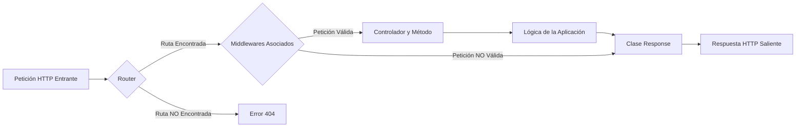

# Guía Detallada de Enrutamiento en versaWYS-PHP

El sistema de enrutamiento es una de las partes más cruciales de cualquier aplicación web moderna. Actúa como un controlador de tráfico, dirigiendo las peticiones HTTP entrantes a la lógica de tu aplicación (controladores y métodos específicos) que se encargará de procesarlas. En versaWYS-PHP, esta funcionalidad se gestiona principalmente a través de la clase `versaWYS\kernel\Router`.

## ¿Qué es el Enrutamiento?

En esencia, el enrutamiento consiste en mapear URLs (Uniform Resource Locators) y métodos HTTP (GET, POST, PUT, DELETE, etc.) a funciones o métodos de clases específicas dentro de tu aplicación. Cuando un usuario accede a una URL en su navegador, o una aplicación cliente envía una petición a tu API, el enrutador determina qué pieza de código debe ejecutarse para manejar esa petición.

### Diagrama de Flujo Básico de una Petición



## Definición de Rutas Básicas

Las rutas se definen utilizando los métodos estáticos de la clase `Router` que se corresponden con los verbos HTTP. Debes especificar el patrón de la URL que la ruta debe coincidir y el "callback" a ejecutar, que usualmente es un array compuesto por el nombre de la clase del controlador y el nombre del método a invocar.

```php
<?php
// En tu archivo de rutas (ej: app/routes/web.php o similar)

use versaWYS\kernel\Router;
use App\Controllers\HomeController; // Asegúrate que los namespaces sean correctos
use App\Controllers\UserController;

// Ruta para la página de inicio (GET)
Router::get('/', [HomeController::class, 'index']);

// Ruta para crear un nuevo usuario (POST)
Router::post('/users', [UserController::class, 'store']);

// Ruta para actualizar un usuario existente (PUT)
Router::put('/users/{id}', [UserController::class, 'update']);

// Ruta para actualizar parcialmente un usuario existente (PATCH)
Router::patch('/users/{id}', [UserController::class, 'modify']);

// Ruta para eliminar un usuario (DELETE)
Router::delete('/users/{id}', [UserController::class, 'destroy']);
```

## Parámetros de Ruta Dinámicos

El enrutador de versaWYS-PHP permite definir rutas con segmentos dinámicos. Estos segmentos se encierran entre llaves `{}` en el patrón de la ruta. Los valores de estos segmentos se capturan de la URL de la petición y se pasan como argumentos al método del controlador, en el mismo orden en que aparecen en la definición de la ruta.

**Ejemplo:**

Para una ruta definida como:
```php
Router::get('/blog/{category}/{slug}', [BlogController::class, 'showPost']);
```

El método `showPost` en la clase `BlogController` recibiría dos argumentos: `$category` y `$slug`.
```php
<?php

namespace App\Controllers; // Asegúrate que el namespace sea correcto

class BlogController {
    public function showPost($category, $slug) {
        // Lógica para buscar y mostrar el post
        // basado en la categoría y el slug proporcionados.
        return "Mostrando post de la categoría: " . htmlspecialchars($category) . " con slug: " . htmlspecialchars($slug);
    }
}
```
Si un usuario navega a `/blog/tecnologia/mi-primer-post`, el método `showPost` será llamado con `$category = "tecnologia"` y `$slug = "mi-primer-post"`.

## Organización de Archivos de Rutas

A medida que una aplicación crece, el número de rutas puede aumentar considerablemente. Para mantener el código organizado y manejable, es una buena práctica dividir las definiciones de rutas en múltiples archivos. Estos archivos suelen residir en el directorio `app/routes/`. Consulta la [Guía de Estructura de Directorios](./EstructuraDeDirectorios.md) para más detalles.

Por ejemplo, podrías tener:
- `web.php`: Para rutas relacionadas con la interfaz web principal.
- `api.php`: Para rutas destinadas a una API.
- `auth.php`: Para rutas de autenticación (login, registro, etc.).
- O, como se observa en la estructura de versaWYS-PHP, archivos específicos por módulo o funcionalidad principal:
    - `DashboardRoutes.php`
    - `ModulesRoutes.php`
    - `UsersRoutes.php`
    - `versaRoutes.php` (para rutas internas del framework o de depuración)

Estos archivos de rutas son luego cargados por el framework, usualmente en un punto central de la aplicación (como en el `index.php` o un archivo de bootstrap) para que el `Router` conozca todas las rutas disponibles.

## Agrupación de Rutas con `Router::group`

A partir de la versión 2025.05, versaWYS-PHP soporta la agrupación de rutas mediante el método `Router::group`. Esta funcionalidad permite definir un conjunto de rutas bajo un mismo prefijo y/o aplicar un conjunto de middlewares a todas ellas de forma sencilla y centralizada.

### ¿Para qué sirve?
- **Prefijos comunes:** Agrupa rutas bajo un segmento de URL compartido (por ejemplo, `/admin`, `/api`, `/bot`).
- **Middlewares compartidos:** Aplica uno o varios middlewares a todas las rutas del grupo, evitando repeticiones.
- **Organización:** Mejora la legibilidad y el mantenimiento de tus archivos de rutas.

### Sintaxis básica
```php
Router::group('/prefijo', function() {
    // Aquí defines las rutas del grupo
    Router::get('/ruta1', ...);
    Router::post('/ruta2', ...);
    // ...
}, [
    [Middleware1::class, 'metodo'],
    [Middleware2::class, 'metodo'],
]);
```
- El primer argumento es el prefijo de ruta (se antepone a todas las rutas del grupo).
- El segundo argumento es una función anónima donde defines las rutas.
- El tercer argumento (opcional) es un array de middlewares que se aplicarán a todas las rutas del grupo.

### Ejemplo práctico: Agrupando rutas de un bot
Supongamos que tienes un bot de WhatsApp y quieres agrupar todas sus rutas bajo `/bot`, aplicando un middleware de autenticación a todas ellas:

```php
<?php
use versaWYS\kernel\Router;
use app\controllers\AppBotController;
use app\middleware\AuthMiddleware;

Router::group('/bot', function() {
    // Ruta para recibir webhooks de WhatsApp
    Router::post('/webhook', [AppBotController::class, 'handleWebhook']);
    // Ruta para consultar el estado del bot
    Router::get('/status', [AppBotController::class, 'status']);
    // Ruta para enviar un mensaje desde el panel
    Router::post('/send', [AppBotController::class, 'sendMessage']);
}, [
    [AuthMiddleware::class, 'protectedRoute'] // Todas las rutas requieren autenticación
]);
```

En este ejemplo:
- Todas las rutas tendrán el prefijo `/bot` (por ejemplo, `/bot/webhook`, `/bot/status`).
- Todas las rutas estarán protegidas por el middleware `AuthMiddleware::protectedRoute`.
- Puedes seguir usando middlewares adicionales en rutas individuales si lo necesitas.

### Middlewares adicionales por ruta
Si necesitas aplicar un middleware extra a una ruta específica dentro del grupo, simplemente pásalo como argumento en la definición de la ruta:

```php
Router::get('/status', [WhatsAppBotController::class, 'status'], [
    [OtroMiddleware::class, 'soloAdmins']
]);
```
O
```php
Router::get('/status', [WhatsAppBotController::class, 'status'])
    ->middleware([[OtroMiddleware::class, 'soloAdmins']]);
```


En este caso, la ruta `/bot/status` ejecutará primero los middlewares del grupo y luego el middleware adicional `soloAdmins`.

---

## La Clase `Request` (`versaWYS\kernel\Request`)

Antes de que una ruta pueda ser completamente procesada, es esencial entender cómo la aplicación accede a la información de la petición HTTP entrante. La clase `versaWYS\kernel\Request` encapsula estos datos. Una instancia de esta clase suele estar disponible globalmente (a menudo como `global $request;`) o puede ser inyectada donde sea necesario.

Proporciona métodos para acceder a:

*   **Parámetros de la Ruta**: Como se vio anteriormente, estos se pasan directamente como argumentos a los métodos de tu controlador.
*   **Parámetros de Consulta (Query String)**: Para una URL como `/search?term=versawys&page=2`, puedes obtener `term` y `page`.
*   **Datos de Formularios (POST)**: Campos enviados desde formularios HTML (`application/x-www-form-urlencoded` o `multipart/form-data`).
*   **Cuerpo JSON**: Datos enviados como JSON (común en APIs, con `Content-Type: application/json`).
*   **Archivos Subidos**: Información sobre archivos enviados a través de formularios.
*   **Cabeceras HTTP**: Como `User-Agent`, `Authorization`, `Accept`, etc.
*   **Método HTTP**: GET, POST, PUT, PATCH, DELETE.
*   **URL Completa**, **Path de la Petición**, **IP del Cliente**, etc.
*   **Tipo de Contenido (Content-Type)**: Para determinar cómo procesar el cuerpo de la petición.

**Obtención de Datos de Entrada:**

```php
<?php

namespace App\Controllers; // Asegúrate que el namespace sea correcto

use versaWYS\kernel\Request; // O accede a la instancia global $request

class UserController {

    public function store(Request $requestInstance) { // $requestInstance sería la instancia global
        // Obtener un solo parámetro (de query, POST, o JSON decodificado si el Content-Type es apropiado)
        $name = $requestInstance->get('name');
        $email = $requestInstance->get('email');

        // Obtener todos los parámetros (query, POST, o JSON decodificado)
        $allParams = $requestInstance->getAllParams();

        // Ejemplo específico para cuerpo JSON
        $contentType = $requestInstance->getContentType() ?? '';
        if (str_contains(strtolower($contentType), 'application/json')) {
            $jsonData = $requestInstance->getAllParams(); // getAllParams ya maneja la decodificación JSON
            // $rawJsonBody = $requestInstance->getRawBody(); // Para el cuerpo JSON crudo
        }

        // Acceder a archivos subidos
        // Para un solo archivo <input type="file" name="avatar">
        $avatarFile = $requestInstance->file('avatar'); // Retorna un objeto versaWYS\kernel\File
        if ($avatarFile && $avatarFile->isValid()) {
            $newPath = '/path/to/your/storage/' . $avatarFile->getHashedName();
            $avatarFile->moveTo($newPath);
        }

        // Para múltiples archivos <input type="file" name="photos[]" multiple>
        $photoFiles = $requestInstance->getAllFiles('photos'); // Retorna un array de objetos File
        foreach ($photoFiles as $photo) {
            if ($photo->isValid()) {
                $photo->moveTo('/path/to/gallery/' . $photo->getHashedName());
            }
        }

        // Obtener una cabecera específica
        $userAgent = $requestInstance->getHeader('User-Agent');

        // Obtener el método HTTP real (GET, POST, PUT, etc.)
        $method = $requestInstance->getMethod();

        // Obtener el cuerpo crudo de la petición (útil para webhooks o datos no estándar)
        $rawBody = $requestInstance->getRawBody();

        // ... procesar datos y luego usar la clase Response para responder ...
        // Ejemplo: return Response::json(['message' => 'Usuario procesado', 'name' => $name]);
    }
}
```

**Simulación de Verbos HTTP (Method Spoofing):**

Los formularios HTML estándar solo soportan los métodos GET y POST. Para permitir el uso de otros verbos HTTP como PUT, PATCH o DELETE a través de un formulario HTML, versaWYS-PHP (como muchos otros frameworks) soporta la "simulación de método" o "method spoofing".

Puedes incluir un campo oculto llamado `_method` en tu formulario, cuyo valor sea el verbo HTTP que deseas simular:

```html
<form action="/users/1" method="POST">
    <input type="hidden" name="_method" value="PUT">
    <!-- Otros campos del formulario para actualizar el usuario -->
    <button type="submit">Actualizar Usuario</button>
</form>
```
Cuando la clase `Request` procesa esta petición POST, detectará el campo `_method` con valor `PUT`. Internamente, tratará esta petición como si hubiera sido una petición PUT. El `Router` entonces buscará una coincidencia con una ruta definida mediante `Router::put('/users/{id}', ...)`.

## Middlewares

Los middlewares proporcionan un mecanismo flexible y potente para filtrar las peticiones HTTP que entran a tu aplicación *antes* de que lleguen al controlador y método designados por una ruta. Son como "capas" por las que pasa una petición.

Usos comunes de los middlewares incluyen:
-   Verificación de autenticación de usuarios.
-   Validación de tokens CSRF.
-   Registro de peticiones (logging).
-   Modificación de cabeceras de la petición o respuesta.
-   Control de acceso basado en roles o permisos.
-   Manejo de CORS.

En versaWYS-PHP, los middlewares se definen como clases, a menudo heredando de una clase base como `versaWYS\kernel\GlobalMiddleWare` (si existe tal abstracción para funcionalidades comunes). Estas clases contienen métodos que implementan la lógica de filtrado.

Luego, se asocian a una ruta utilizando el método `middleware()` encadenado a la definición de la ruta. Este método acepta un array de middlewares, donde cada middleware se especifica como un array `[$claseMiddleware, $metodoEnClaseAEjecutar]`.

Los middlewares se ejecutan en el orden en que se definen en el array. Si un middleware necesita detener el procesamiento de la petición (por ejemplo, porque el usuario no está autenticado y debe ser redirigido), puede enviar una respuesta directamente (usando la clase `Response`) y terminar la ejecución del script (usualmente con `exit()`). Si el middleware permite que la petición continúe, simplemente no retorna nada o retorna `true` (dependiendo de la convención del framework).

**Ejemplo de definición de un middleware (`AuthMiddleware`):**

```php
<?php
// En app/middleware/AuthMiddleware.php

namespace app\middleware; // Asegúrate que el namespace sea correcto

use versaWYS\kernel\GlobalMiddleWare; // Si existe y se usa
use versaWYS\kernel\Response;
use versaWYS\kernel\Session; // Asumiendo que la sesión se maneja así

class AuthMiddleware extends GlobalMiddleWare { // O sin herencia si no es necesaria

    /**
     * Protege una ruta. Si el usuario no está autenticado,
     * lo redirige a la página de login configurada.
     */
    public function protectedRoute(): void
    {
        // global $session; // Si se accede a la sesión globalmente
        $session = Session::getInstance(); // O si se obtiene una instancia

        if (!$session->checkUserSession()) { // Método hipotético para verificar sesión
            // Si no está autenticado, redirige (ej. a '/admin/login')
            Response::redirect('/admin/login'); // Ajusta esta ruta según tu configuración
            exit(); // Detiene la ejecución para evitar que continúe al controlador
        }
        // Si la sesión es válida, el middleware no retorna nada explícitamente,
        // permitiendo que la petición continúe al siguiente middleware o al controlador.
    }

    public function onlyDebug(): void
    {
        // Ejemplo de un método que podría estar en GlobalMiddleWare
        // y ser heredado por AuthMiddleware.
        // Verifica si la aplicación está en modo debug.
        $config = ConfigManager::getConfig(); // Asumiendo una forma de obtener la config
        if (!$config['build']['debug']) {
            Response::jsonError(['message' => 'Acceso denegado. Esta ruta solo está disponible en modo debug.'], 403);
            // exit(); // jsonError ya incluye exit()
        }
    }

    // ... otros métodos como validateParamsLogin, redirectIfSession, validateCSRFToken, etc. ...
}
```

**Aplicando el middleware a una ruta:**

1.  **Ejemplo usando un método del propio `AuthMiddleware` (`protectedRoute`):**
    Este es un caso común para proteger rutas que solo usuarios autenticados pueden ver.
    ```php
    <?php
    // En tu archivo de rutas (ej: app/routes/DashboardRoutes.php)

    use versaWYS\kernel\Router;
    use app\controllers\DashboardController; // Asegúrate que el namespace sea correcto
    use app\middleware\AuthMiddleware;

    Router::get('/dashboard', [DashboardController::class, 'index'])
          ->middleware([[AuthMiddleware::class, 'protectedRoute']]);
    ```

2.  **Ejemplo usando un método heredado o propio como `onlyDebug`:**
    El archivo `app/routes/versaRoutes.php` podría usar un middleware para restringir el acceso a rutas de depuración.
    ```php
    <?php
    // En app/routes/versaRoutes.php

    declare(strict_types=1);
    namespace app\routes;

    use app\middleware\AuthMiddleware; // O directamente GlobalMiddleWare si 'onlyDebug' está allí
    use versaWYS\kernel\Router;
    use versaWYS\kernel\versaController; // Controlador del kernel para rutas internas

    // Ruta para documentación o herramientas de debug internas
    Router::get('/doc', [versaController::class, 'versaRoute'])
          ->middleware([[AuthMiddleware::class, 'onlyDebug']]);
    ```

**Múltiples Middlewares:**

Se pueden aplicar múltiples middlewares a una misma ruta, simplemente añadiéndolos al array. Se ejecutarán en el orden en que se definen. Si alguno de ellos detiene la ejecución (ej. con una redirección y `exit()`), los middlewares subsiguientes y el controlador no se ejecutarán.

```php
<?php
// Ejemplo con múltiples middlewares

use app\controllers\AdminController; // Asegúrate que el namespace sea correcto
use app\middleware\AdminCheckMiddleware; // Un hipotético middleware para verificar roles de admin

Router::get('/admin/settings', [AdminController::class, 'settings'])
      ->middleware([
          [AuthMiddleware::class, 'protectedRoute'],      // Primero verifica si está logueado
          [AdminCheckMiddleware::class, 'verifyAdminRole'] // Luego verifica si tiene rol de admin
      ]);
```

## Resolución de Rutas y Flujo de Petición Detallado

El método `Router::resolve()` (o un método similar interno en el kernel del framework) es el corazón del sistema de enrutamiento. Es el encargado de tomar la URL y el método HTTP de la petición entrante y decidir qué hacer.

A continuación, se presenta una tabla que detalla el flujo típico:

| Paso | Acción                                       | Detalle / Resultado                                                                                                                                  |
| :--- | :------------------------------------------- | :--------------------------------------------------------------------------------------------------------------------------------------------------- |
| 1    | **Normalizar URL de Petición**               | Se procesa la URL de la petición (ej. se eliminan barras finales, se decodifican caracteres) para obtener un path estándar.                             |
| 2    | **Identificar Método HTTP**                  | Se determina el verbo HTTP de la petición (GET, POST, PUT, DELETE, etc.), considerando la simulación de método (`_method`).                               |
| 3    | **Buscar Coincidencia de Ruta**              | El sistema itera sobre las rutas definidas para el método HTTP actual, comparando el patrón de cada ruta con el path de la petición.                     |
| 4    | **Si se encuentra una ruta coincidente:**    |                                                                                                                                                      |
|      | a. Extraer Parámetros Dinámicos              | Si la ruta tiene parámetros dinámicos (ej. `{id}`), sus valores se extraen de la URL.                                                                  |
|      | b. Ejecutar Middlewares Asociados            | Los middlewares definidos para la ruta se ejecutan en orden. <br/> - Si un middleware envía una respuesta y termina el script, el flujo se detiene aquí. |
|      | c. Instanciar Controlador y Llamar Método    | Si todos los middlewares lo permiten, se crea una instancia del controlador especificado y se invoca el método designado, pasando los parámetros dinámicos. |
|      | d. Procesar y Enviar Respuesta               | El valor retornado por el método del controlador es procesado. La clase `Response` se utiliza para construir y enviar la respuesta HTTP final al cliente. |
| 5    | **Si no se encuentra ruta coincidente:**     |                                                                                                                                                      |
|      | Generar Error 404 (No Encontrado)            | Se envía una respuesta de "No Encontrado" (usualmente un código de estado HTTP 404) al cliente, a menudo renderizando una página de error específica.     |

## La Clase `Response` (`versaWYS\kernel\Response`)

Una vez que el controlador (y los middlewares, si aplica) han procesado la petición, la aplicación necesita enviar una respuesta de vuelta al cliente (navegador, aplicación móvil, etc.). La clase `versaWYS\kernel\Response` es la encargada de construir y enviar esta respuesta HTTP. Proporciona métodos estáticos para facilitar el envío de diferentes tipos de contenido y códigos de estado.

### Métodos Principales

#### `Response::json(array $data, int $code = 200): bool|string`

Este método se utiliza para enviar una respuesta en formato JSON. Es fundamental para construir APIs.

-   **Parámetros:**
    -   `$data` (array): Los datos (usualmente un array asociativo) que se codificarán a formato JSON.
    -   `$code` (int, opcional): El código de estado HTTP para la respuesta. Por defecto es `200` (OK). Para errores, se usan códigos como `400`, `401`, `404`, `500`, etc.
-   **Retorno:**
    -   `true` si la respuesta JSON se envió correctamente.
    -   `false` si hubo un error al procesar los datos (por ejemplo, si `$data` no es un array o un objeto, o si ocurrió un error PHP previo no capturado que `error_get_last()` detecta).
    -   En caso de un error PHP previo detectado por `error_get_last()`, internamente llama a `self::jsonError()` para mostrar un error de depuración.
-   **Funcionamiento:**
    1.  Verifica si ha ocurrido algún error PHP no manejado (`error_get_last()`). Si es así, prepara un array de error y llama a `self::jsonError()`.
    2.  Si no hay errores previos y `$data` es un array o un objeto, establece la cabecera HTTP `Content-Type: application/json` y el código de estado HTTP proporcionado.
    3.  Imprime la representación JSON de `$data` usando `json_encode()`.
    4.  Si `$data` no es un array ni un objeto (y no hubo error previo), llama a `self::jsonError()` con un mensaje de error genérico y código 500.

**Ejemplo de uso en un controlador:**
```php
<?php
// En un controlador
use versaWYS\kernel\Response;

// ...

public function getUserData($id)
{
    $user = // ... lógica para obtener datos del usuario por $id ...
    if ($user) {
        return Response::json(['status' => 'success', 'data' => $user], 200);
    } else {
        return Response::json(['status' => 'error', 'message' => 'Usuario no encontrado'], 404);
    }
}
```

#### `Response::jsonError(array $data, int $code = 200): bool`

Este método está diseñado para enviar una respuesta de error formateada como HTML, utilizando una plantilla Twig (`versaWYS/debugError.twig`). Aunque el nombre incluye "json", su salida principal es HTML, pensada para la depuración durante el desarrollo.

-   **Parámetros:**
    -   `$data` (array): Un array que contiene los detalles del error (ej. `['message' => 'Descripción del error', 'code' => HTTP_CODE, 'errors' => ...]`).
    -   `$code` (int, opcional): El código de estado HTTP. Por defecto es `200`, pero usualmente se debería usar un código de error apropiado (4xx o 5xx).
-   **Retorno:**
    -   `bool`: Este método siempre termina la ejecución del script (`exit()`), por lo que el valor de retorno no es directamente utilizable por el código que lo llama.
-   **Funcionamiento:**
    1.  Establece el código de estado HTTP.
    2.  Renderiza la plantilla Twig `versaWYS/debugError.twig`, pasándole el array `$data` para que la plantilla pueda mostrar los detalles del error.
    3.  Termina la ejecución del script con `exit()`.

**Nota Importante:** Este método es muy útil durante el desarrollo para ver errores de forma clara en el navegador. Sin embargo, para APIs en producción que deben devolver errores en formato JSON, deberías usar `Response::json()` con un payload de error estructurado y el código de estado HTTP adecuado, en lugar de `jsonError()`.

#### `Response::textPlain(string $data, int $code = 200): bool|string`

Envía una respuesta como texto plano (`Content-Type: text/plain`).

-   **Parámetros:**
    -   `$data` (string): La cadena de texto que se enviará como cuerpo de la respuesta.
    -   `$code` (int, opcional): El código de estado HTTP. Por defecto es `200`.
-   **Retorno:**
    -   `true` si la respuesta se envió correctamente.
    -   `false` si ocurrió un error PHP previo (en cuyo caso llama a `jsonError`).
-   **Funcionamiento:**
    1.  Similar a `Response::json()`, primero verifica `error_get_last()` para errores PHP no manejados.
    2.  Establece la cabecera `Content-Type: text/plain` y el código de estado HTTP.
    3.  Imprime la cadena `$data`.

**Ejemplo de uso:**
```php
<?php
// En un controlador
use versaWYS\kernel\Response;

// ...

public function healthCheck()
{
    // Usado comúnmente para endpoints de verificación de estado del servicio
    return Response::textPlain('OK', 200);
}
```

#### `Response::redirect(string $route): void`

Redirige el navegador del cliente a una nueva URL o ruta.

-   **Parámetros:**
    -   `$route` (string): La URL absoluta (ej. `https://ejemplo.com/nueva-pagina`) o la ruta relativa (ej. `/admin/login`, `/dashboard`) a la cual redirigir.
-   **Retorno:**
    -   `void`. Este método envía una cabecera HTTP `Location` y, crucialmente, **no termina la ejecución del script por sí mismo**. Es una práctica **muy recomendada** llamar a `exit()` inmediatamente después de `Response::redirect()` para asegurar que el script no continúe su ejecución y potencialmente envíe contenido no deseado o ejecute lógica adicional.
-   **Funcionamiento:**
    1.  Envía la cabecera HTTP `Location: ` seguida de la ruta especificada.

**Ejemplo de uso en un controlador o middleware:**
```php
<?php
// En un controlador o middleware
use versaWYS\kernel\Response;
use versaWYS\kernel\Session;

// ...

public function logout()
{
    $session = Session::getInstance();
    $session->destroy(); // Lógica para cerrar sesión

    Response::redirect('/login');
    exit(); // ¡Importante para detener la ejecución y asegurar la redirección!
}
```

Estos métodos de la clase `Response` son herramientas esenciales para controlar cómo tu aplicación versaWYS-PHP se comunica con el cliente después de que una petición ha sido procesada a través del sistema de enrutamiento y los controladores.

## Ejemplos Prácticos del Framework (`app/routes/DashboardRoutes.php`)

Para ilustrar mejor cómo se definen las rutas y se aplican los middlewares en un contexto real dentro de versaWYS-PHP, veamos algunos ejemplos tomados directamente del archivo `app/routes/DashboardRoutes.php` (o archivos similares en tu aplicación). Puedes generar estos archivos y middlewares usando [versaCLI](./Guia_versaCLI.md).

**1. Ruta GET Protegida por Middleware de Sesión:**

Esta ruta define el acceso al panel de administración principal. Utiliza el middleware `AuthMiddleware` (específicamente, un método como `checkSession` o `protectedRoute`) para asegurar que solo los usuarios con una sesión activa y válida puedan acceder.

```php
<?php
// En app/routes/DashboardRoutes.php

use app\controllers\DashBoardController; // Asegúrate que el namespace sea correcto
use app\middleware\AuthMiddleware;
use versaWYS\kernel\Router;

// ... otras rutas ...

Router::get('/admin/dashboard', [DashBoardController::class, 'dashboard'])
      ->middleware([
          [AuthMiddleware::class, 'checkSession'], // o 'protectedRoute'
      ]);
```

**2. Ruta POST con Cadena de Middlewares para Autenticación:**

Esta ruta maneja el proceso de autenticación cuando un usuario intenta iniciar sesión. Aplica una cadena de tres (o más) métodos del `AuthMiddleware` para:
1.  Validar un token CSRF (para prevenir ataques de falsificación de petición en sitios cruzados).
2.  Validar los parámetros de login (ej. que el email y la contraseña no estén vacíos y tengan un formato correcto).
3.  Validar los intentos de acceso (para prevenir ataques de fuerza bruta).

Solo si todos estos middlewares pasan la validación, la petición llegará al método `autentication` del `DashBoardController`.

```php
<?php
// En app/routes/DashboardRoutes.php

use app\controllers\DashBoardController;
use app\middleware\AuthMiddleware;
use versaWYS\kernel\Router;

// ... otras rutas ...

Router::post('/admin/login/autentication', [DashBoardController::class, 'autentication'])
      ->middleware([
          [AuthMiddleware::class, 'validateCSRFToken'],
          [AuthMiddleware::class, 'validateParamsLogin'],
          [AuthMiddleware::class, 'validateAttemps'],
      ]);
```

Estos ejemplos demuestran el uso práctico del sistema de enrutamiento y middlewares, mostrando cómo se estructuran las definiciones de rutas en archivos específicos dentro del directorio `app/routes/` y cómo se integran los middlewares para la seguridad, validación y otras lógicas transversales de la aplicación.

¿Dudas? Consulta la [Guía de Enrutamiento](./Enrutamiento.md), la [Guía de Línea de Comandos (CLI)](./Guia_versaCLI.md) o abre un issue en el repositorio.
